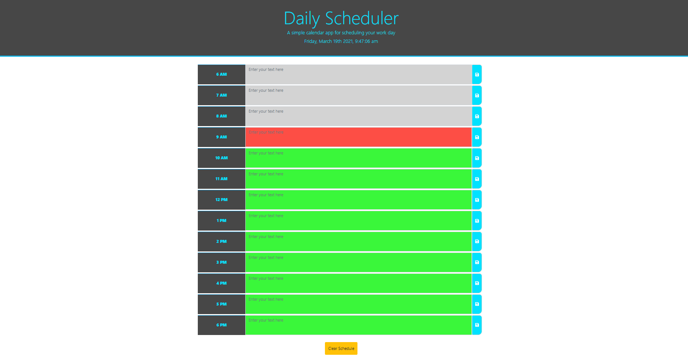

# Daily_Scheduler

## Description 

A daily scheduler. Today's date and hour blocks from 9-5 are presented. The user can enter data into each hour block to document their schedule for the day.

Published at: 

## Table of Contents

* [Usage](#usage)
* [Resources](#resources)
* [License](#license)

## Usage 

1. Choose a time block to enter activites for each hour of the day.
2. Click save to save data for each hour.
3. Click Clear button to clear schedule.
4. Refresh page to see changes on clear.00

Link to page: https://lpaschka37.github.io/Daily_Scheduler

## Resources

https://momentjs.com/

https://fontawesome.com/icons/save?style=solid

https://developer.mozilla.org/en-US/docs/Web/JavaScript/Reference/Global_Objects/Array/forEach?fbclid=IwAR2iJ1f1DUvB9q14ZSprMCNYmV35wGlMVS0LUY9xB5HWZCWZb9TSMYVQgFg  

## Copyright

Copyright 2020 Luke Paschka

Permission is hereby granted, free of charge, to any person obtaining a copy of this software and associated documentation files (the "Software"), to deal in the Software without restriction, including without limitation the rights to use, copy, modify, merge, publish, distribute, sublicense, and/or sell copies of the Software, and to permit persons to whom the Software is furnished to do so, subject to the following conditions:

The above copyright notice and this permission notice shall be included in all copies or substantial portions of the Software.

THE SOFTWARE IS PROVIDED "AS IS", WITHOUT WARRANTY OF ANY KIND, EXPRESS OR IMPLIED, INCLUDING BUT NOT LIMITED TO THE WARRANTIES OF MERCHANTABILITY, FITNESS FOR A PARTICULAR PURPOSE AND NONINFRINGEMENT. IN NO EVENT SHALL THE AUTHORS OR COPYRIGHT HOLDERS BE LIABLE FOR ANY CLAIM, DAMAGES OR OTHER LIABILITY, WHETHER IN AN ACTION OF CONTRACT, TORT OR OTHERWISE, ARISING FROM, OUT OF OR IN CONNECTION WITH THE SOFTWARE OR THE USE OR OTHER DEALINGS IN THE SOFTWARE.

## Badges

